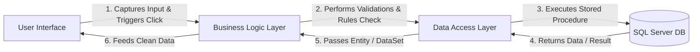

# BLL & DAL Input Validation Mapping Document

This document maps all **85 Microsoft SQL Server Stored Procedures** in the `Personal Expense Credit Tracker` system to their corresponding **UI screen elements, user click triggers, and Business Logic Layer (BLL) validation rules**.

The BLL acts as a gatekeeper between the User Interface (UI) and the Data Access Layer (DAL), ensuring no invalid, incomplete, or corrupted data is sent to the database.

---

## 🏗️ The 3-Layer Execution Flow


---

## 🟣 Module 1: Authentication & User Profile
**Assigned Folder:** `Database/Procedures/Authentication`

| Stored Procedure | UI Trigger Event & Source File | Input Parameters from UI | BLL Validation & Constraints |
| :--- | :--- | :--- | :--- |
| **`spRegisterUser`** | `RegistrationControls.cs` <br> "Sign Up" Button Click (`button1_Click`) | `@UserName`<br>`@Email`<br>`@PhoneNumber`<br>`@Password` | • **UserName**: Not empty, max 50 chars, alphanumeric/spaces only.<br>• **Email**: Not empty, must match email regex pattern, max 100 chars.<br>• **PhoneNumber**: Not empty, must be exactly 10 digits.<br>• **Password**: Minimum 6 characters with password strength one special character , one number and one uppercase letter. |
| **`spLoginUser`** | `LoginControls.cs` <br> "Login" Button Click (`button1_Click`) | `@Email`<br>`@Password` | • **Email**: Not empty, must match email regex pattern.<br>• **Password**: Not empty. |
| **`spForgetPassword`** | `LoginControls.cs` <br> "Forgot Password?" Label Click (`label17_Click`) | `@Email` (or Phone Number) | • **Email**: Not empty, valid format check. |
| **`spChangePassword`** | `MainForm.cs` <br> Settings -> "Change Password" Panel Click | `@UserID` (Session)<br>`@OldPassword`<br>`@NewPassword` | • **OldPassword**: Not empty.<br>• **NewPassword**: Minimum 6 characters, cannot be identical to `OldPassword`. |
| **`spUpdateUserProfile`** | `EditProfileControls.cs` <br> "Update Profile" Button Click | `@UserID` (Session)<br>`@FullName`<br>`@Email`<br>`@PhoneNumber`<br>`@Address`<br>`@DateOfBirth` | • **FullName**: Not empty, max 100 chars.<br>• **Email**: Valid format.<br>• **PhoneNumber**: Exactly 10 digits.<br>• **DateOfBirth**: Cannot be a future date.<br>• **Address**: Max 200 chars. |
| **`spUpdateProfilePhoto`** | `ProfileControls.cs` / `ImageCropControls.cs` <br> "Save Cropped Image" Button | `@UserID` (Session)<br>`@PhotoData` (byte[]) | • **PhotoData**: Verify not null, file size constraint check. |
| **`spDeleteUserProfilePhotoByUserId`** | `ProfileControls.cs` <br> "Delete Photo" Click | `@UserID` (Session) | • Confirm active UserID exists (> 0). |
| **`spGetActiveUserDetails`** | Application Start / Profile Tab Load | `@UserID` (Session) | • Valid session UserID check. |
| **`spUpdateUserName`** | Profile Edit Screen | `@UserID`, `@UserName` | • **UserName**: Not empty, max 50 chars. |
| **`spUpdateUserEmail`** | Profile Edit Screen | `@UserID`, `@Email` | • **Email**: Not empty, valid email format. |
| **`spUpdateUserPhoneNumber`** | Profile Edit Screen | `@UserID`, `@PhoneNumber` | • **PhoneNumber**: Exactly 10 digits. |
| **`spLogoutUser`** | `MainForm.cs` <br> Logout Panel Click (`pnlLogout_Click`) | `@UserID` (Session) | • Clear session, log logout timestamp. |

---

## 🟢 Module 2: Dashboard & Reminders
**Assigned Folder:** `Database/Procedures/Dashboard` & `Database/Procedures/Borrow` (Partial)

| Stored Procedure | UI Trigger Event & Source File | Input Parameters from UI | BLL Validation & Constraints |
| :--- | :--- | :--- | :--- |
| **`spGetUserDashboard`** | `DashboardControl.cs` <br> UserControl Load Event | `@UserID` (Session) | • Validate active UserID. |
| **`spGetUpcomingTaskReminders`**| Dashboard Control Load / App Startup | `@UserID` (Session) | • Retrieves upcoming tasks due within 24-48 hours. |
| **`spGetUpcomingLentReminders`**| Dashboard Control Load / App Startup | `@UserID` (Session) | • Retrieves lent transactions nearing their due dates. |
| **`spGetUpcomingBorrowReminders`**| Dashboard Control Load / App Startup | `@UserID` (Session) | • Retrieves borrow transactions nearing their due dates. |
| **`spUpdateOverdueStatus`** | Program Startup / Dashboard Load | None / Automated | • Automated trigger to mark overdue borrow/lent entries. |

---

## 🟣 Module 3: Task Management
**Assigned Folder:** `Database/Procedures/Task`

| Stored Procedure | UI Trigger Event & Source File | Input Parameters from UI | BLL Validation & Constraints |
| :--- | :--- | :--- | :--- |
| **`spInsertTask`** | `AddTaskControl.cs` <br> "Add Task" Button Click (`btnAddTask_Click`) | `@UserID` (Session)<br>`@Title`<br>`@Description`<br>`@PriorityID`<br>`@StatusID`<br>`@DueDate` | • **Title**: Not empty, max 100 chars.<br>• **Description**: Max 500 chars.<br>• **PriorityID / StatusID**: Must select valid combobox item.<br>• **DueDate**: Must be $\ge$ current date (no historical tasks). |
| **`spUpdateTask`** | `EditTaskControl.cs` <br> "Update" Button Click (`btnUpdateTask_Click`) | `@TaskID`<br>`@Title`<br>`@Description`<br>`@PriorityID`<br>`@StatusID`<br>`@DueDate` | • **TaskID**: Must be valid (> 0).<br>• **Title**: Not empty.<br>• **DueDate**: Valid date range. |
| **`spDeleteTask`** | `DeleteTaskControl.cs` / `TaskControls.cs` <br> Click Context Menu "Delete" | `@TaskID`, `@UserID` | • **TaskID**: Must be valid (> 0). |
| **`spUpdateTaskStatus`** | `UpdateTaskStatusControl.cs` / Checked Change | `@TaskID`, `@StatusID` | • TaskID and StatusID must be valid integers. |
| **`spGetAllTasks`** | `TaskControls.cs` <br> Load Task Grid | `@UserID` (Session) | • Valid session UserID check. |
| **`spFilterTasksByStatus`** | `TaskControls.cs` <br> Status Tab Filter click | `@UserID`, `@StatusID` | • Validate selection status code. |
| **`spGetCompletedTasks`** | `TaskControls.cs` <br> Completed Filter Tab | `@UserID` | • Filter active user's completed tasks. |
| **`spGetPendingTasks`** | `TaskControls.cs` <br> Pending Filter Tab | `@UserID` | • Filter active user's pending tasks. |
| **`spGetTasksBetweenDates`** | `TaskControls.cs` <br> Date Filter Click | `@UserID`, `@StartDate`, `@EndDate` | • **Date Range**: `@StartDate` must be $\le$ `@EndDate`. |

---

## 🔵 Module 4: Notes Management
**Assigned Folder:** `Database/Procedures/Note`

| Stored Procedure | UI Trigger Event & Source File | Input Parameters from UI | BLL Validation & Constraints |
| :--- | :--- | :--- | :--- |
| **`spInsertNote`** | `NoteAddDetailsControl.cs` <br> "Save" Click | `@UserID` (Session)<br>`@Title`<br>`@Content`<br>`@PriorityID` | • **Title**: Not empty, max 150 chars.<br>• **Content**: Not empty.<br>• **PriorityID**: Must be selected. |
| **`spUpdateNote`** | `NoteEditDetailsControl.cs` <br> "Update" Click | `@NoteID`<br>`@Title`<br>`@Content`<br>`@PriorityID` | • **NoteID**: Must be valid (> 0).<br>• **Title/Content**: Cannot be empty. |
| **`spDeleteNote`** | `NoteControl.cs` <br> Context Menu -> Click "Delete Note" | `@NoteID`, `@UserID` | • **NoteID**: Must be valid. |
| **`spUpdateNotePriority`** | `NoteControl.cs` <br> Star Icon Click (`picNoteImportant_Click`) | `@NoteID`, `@PriorityID` | • Swap priority status between Normal and Important. |
| **`spGetAllNotes`** | `NoteControl.cs` <br> Notes Panel Grid Load | `@UserID` (Session) | • Valid session UserID check. |
| **`spFilterNotesByPriority`** | `NoteControl.cs` <br> Priority Header click | `@UserID`, `@PriorityID` | • Priority value must be valid. |
| **`spGetNotesBetweenDates`** | `NoteControl.cs` <br> Date Filter Selected | `@UserID`, `@StartDate`, `@EndDate` | • **Date Range**: `@StartDate` must be $\le$ `@EndDate`. |

---

## 🟢 Module 5: Expense Tracker
**Assigned Folder:** `Database/Procedures/Expense`

| Stored Procedure | UI Trigger Event & Source File | Input Parameters from UI | BLL Validation & Constraints |
| :--- | :--- | :--- | :--- |
| **`spInsertExpenseByUserID`** | `ExpenseDetailsControl.cs` <br> "Save Expense" Button Click | `@UserID` (Session)<br>`@CategoryID`<br>`@SubCategoryID`<br>`@PaymentTypeID`<br>`@Amount`<br>`@Date`<br>`@Description` | • **Amount**: Must be $> 0$.<br>• **Category/SubCategory/PaymentType**: Must be selected (> 0).<br>• **Date**: Valid format, cannot exceed current date (no future expenses).<br>• **Description**: Max 200 chars. |
| **`spGetAllExpensesByID`** | `ExpenseControl.cs` <br> List Grid Load | `@UserID` (Session) | • Valid session UserID check. |
| **`spFilterExpenseByDateRange`** | `ExpenseControl.cs` <br> Date Filter Selected | `@UserID`, `@StartDate`, `@EndDate` | • **Date Range**: `@StartDate` must be $\le$ `@EndDate`. |
| **`spFilterExpenseByAmountRange`**| `ExpenseControl.cs` <br> Amount Range Selected | `@UserID`, `@MinAmount`, `@MaxAmount`| • `@MinAmount` must be $\ge 0$ and $\le$ `@MaxAmount`. |
| **`spFilterExpenseByCategory`** | `ExpenseControl.cs` <br> Category filter chosen | `@UserID`, `@CategoryID` | • CategoryID must exist. |
| **`spFilterExpenseByCategoryAndSubCategory`** | `ExpenseControl.cs` <br> Subcategory filter chosen | `@UserID`, `@CategoryID`, `@SubCategoryID` | • CategoryID and SubCategoryID must exist. |
| **`spGetMonthlyExpenseSummary`**| Reports / Dashboard Charts | `@UserID`, `@MonthYear` | • Validate month/year formatting. |
| **`spGetTodayExpense`** | Dashboard Control Load | `@UserID` | • Retrieves today's total expenses. |
| **`spGetCategoryWiseExpenseReport`**| Category Chart UI | `@UserID`, `@StartDate`, `@EndDate` | • **Date Range**: `@StartDate` must be $\le$ `@EndDate`. |

---

## 🔵 Module 6: Credit Tracker
**Assigned Folder:** `Database/Procedures/Credit`

| Stored Procedure | UI Trigger Event & Source File | Input Parameters from UI | BLL Validation & Constraints |
| :--- | :--- | :--- | :--- |
| **`spInsertCreditByUserID`** | `CreditDetailsControl.cs` <br> "Save Credit" Button Click | `@UserID` (Session)<br>`@CategoryID`<br>`@SubCategoryID`<br>`@PaymentID`<br>`@Amount`<br>`@Description` | • **Amount**: Must be $> 0$.<br>• **Category/SubCategory/PaymentType**: Must be selected (> 0).<br>• **Description**: Max 200 chars. |
| **`spGetAllCreditsByID`** | `CreditControl.cs` <br> Grid Load | `@UserID` (Session) | • Valid session UserID check. |
| **`spFilterCreditByDateRange`** | `CreditControl.cs` <br> Date Filter Click | `@UserID`, `@StartDate`, `@EndDate` | • **Date Range**: `@StartDate` must be $\le$ `@EndDate`. |
| **`spFilterCreditByAmountRange`**| `CreditControl.cs` <br> Amount Filter Click | `@UserID`, `@MinAmount`, `@MaxAmount`| • `@MinAmount` must be $\ge 0$ and $\le$ `@MaxAmount`. |
| **`spFilterCreditByCategory`** | `CreditControl.cs` <br> Category Filter | `@UserID`, `@CategoryID` | • CategoryID must exist. |
| **`spFilterCreditByCategoryAndSubCategory`** | `CreditControl.cs` <br> Subcategory Filter | `@UserID`, `@CategoryID`, `@SubCategoryID` | • CategoryID and SubCategoryID must exist. |
| **`spGetMonthlyCreditSummary`**| Reports / Dashboard Charts | `@UserID` | • Valid session check. |
| **`spGetTodayCredit`** | Dashboard Control Load | `@UserID` | • Retrieves today's total credit. |
| **`spGetCategoryWiseCreditReport`**| Category Chart UI | `@UserID`, `@StartDate`, `@EndDate` | • **Date Range**: `@StartDate` must be $\le$ `@EndDate`. |
| **`spGetCreditSubCategoryByCategoryID`**| `CreditDetailsControl.cs` <br> Category Select | `@CategoryID` | • CategoryID must be valid (> 0). |
| **`spGetAllCreditCategory`**| `CreditDetailsControl.cs` <br> Form Load | None | • None. |

---

## 🟣 Module 7: Lent Tracker
**Assigned Folder:** `Database/Procedures/Lent`

| Stored Procedure | UI Trigger Event & Source File | Input Parameters from UI | BLL Validation & Constraints |
| :--- | :--- | :--- | :--- |
| **`spInsertLent`** | `AddLentControls.cs` <br> "Save Lent" Button Click (`btnLentAddSave_Click`) | `@UserID` (Session)<br>`@PersonID`<br>`@Amount`<br>`@LentDate`<br>`@DueDate`<br>`@Description`<br>`@InterestRate` | • **PersonID**: Must select a valid person (> 0).<br>• **Amount**: Must be $> 0$.<br>• **LentDate / DueDate**: `@DueDate` must be $\ge$ `@LentDate`.<br>• **InterestRate**: Must be $\ge 0$ (default to 0 if none). |
| **`spReturnLentByReturnAmount`**| `LentControls.cs` <br> "Receive Payment" Click | `@LentID`<br>`@ReturnAmount`<br>`@ReturnDate`<br>`@UserID` | • **LentID**: Must be valid.<br>• **ReturnAmount**: Must be $> 0$.<br>• **Business Rule Check**: `@ReturnAmount` must not exceed the remaining unpaid lent balance. |
| **`spGetAllLent`** | `LentControls.cs` <br> Grid view load | `@UserID` (Session) | • Valid session check. |
| **`spGetLentPersonHistory`** | History pop-up list | `@UserID`, `@PersonID` | • Valid PersonID check. |
| **`spGetPendingLentByStatusName`**| Filter Tab -> "Pending" Click | `@UserID` | • Pull entries where status is 'Pending' or 'Partially Paid'. |
| **`SpGetCompletedLentByStatusName`**| Filter Tab -> "Completed" Click| `@UserID` | • Pull entries where status is 'Paid' / 'Settled'. |
| **`spGetAllLentBorrowStatus`** | `LentControls.cs` / `AddLentControls.cs` <br> Status ComboBox load | None | • Retrieves all status options for Lent/Borrow. |
| **`spFilterLentByStatus`** | `LentControls.cs` <br> Status Combo Filter | `@UserID`, `@StatusID` | • Valid status ID check. |
| **`spFilterLentByAmountRange`**| `LentControls.cs` <br> Amount Textbox Filter | `@UserID`, `@MinAmount`, `@MaxAmount`| • `@MinAmount` must be $\ge 0$ and $\le$ `@MaxAmount`. |
| **`spFilterLentByDateRange`**  | `LentControls.cs` <br> Date Picker Filter | `@UserID`, `@FromDate`, `@ToDate` | • `@FromDate` must be $\le$ `@ToDate`. |
| **`spFilterLentByPerson`**     | `LentControls.cs` <br> Person Combo Filter | `@UserID`, `@PersonID` | • Valid PersonID check. |
| **`spFilterLentByPaymentMethod`**| `LentControls.cs` <br> Payment Combo Filter | `@UserID`, `@PaymentID` | • Valid PaymentID check. |

---

## 🟢 Module 8: Borrow Tracker
**Assigned Folder:** `Database/Procedures/Borrow`

| Stored Procedure | UI Trigger Event & Source File | Input Parameters from UI | BLL Validation & Constraints |
| :--- | :--- | :--- | :--- |
| **`spInsertBorrow`** | `AddBorrowControls.cs` <br> "Save Borrow" Button Click (`btnBorrowAddSave_Click`) | `@UserID` (Session)<br>`@PersonID`<br>`@Amount`<br>`@BorrowDate`<br>`@DueDate`<br>`@Description` | • **PersonID**: Must select a valid person (> 0).<br>• **Amount**: Must be $> 0$.<br>• **BorrowDate / DueDate**: `@DueDate` must be $\ge$ `@BorrowDate`. |
| **`spPayBorrow`** | `BorrowControls.cs` <br> "Pay Borrow" Button Click | `@BorrowID`<br>`@PayAmount`<br>`@PayDate`<br>`@UserID` | • **BorrowID**: Must be valid.<br>• **PayAmount**: Must be $> 0$.<br>• **Business Rule Check**: `@PayAmount` must not exceed the remaining unpaid borrow balance. |
| **`spGetAllBorrow`** | `BorrowControls.cs` <br> Grid view load | `@UserID` (Session) | • Valid session check. |
| **`spGetBorrowPersonHistory`** | History pop-up list | `@UserID`, `@PersonID` | • Valid PersonID check. |
| **`spGetPendingBorrow`** | Filter Tab -> "Pending" Click | `@UserID` | • Pull entries where status is 'Pending' or 'Partially Paid'. |
| **`spGetCompletedBorrow`** | Filter Tab -> "Completed" Click| `@UserID` | • Pull entries where status is 'Paid'. |
| **`spGetOverduedBorrow`** | Filter Tab -> "Overdue" Click | `@UserID` | • Pull entries marked as 'Overdue'. |
| **`spGetTotalBorrowByPerson`** | Settings -> Persons list loading | `@UserID` | • Aggregates borrow balances per person. |
| **`spFilterBorrowByStatus`** | `BorrowControls.cs` <br> Status Combo Filter | `@UserID`, `@StatusID` | • Valid status ID check. |
| **`spFilterBorrowByAmountRange`**| `BorrowControls.cs` <br> Amount Textbox Filter | `@UserID`, `@MinAmount`, `@MaxAmount`| • `@MinAmount` must be $\ge 0$ and $\le$ `@MaxAmount`. |
| **`spFilterBorrowByDateRange`**  | `BorrowControls.cs` <br> Date Picker Filter | `@UserID`, `@FromDate`, `@ToDate` | • `@FromDate` must be $\le$ `@ToDate`. |
| **`spFilterBorrowByPerson`**     | `BorrowControls.cs` <br> Person Combo Filter | `@UserID`, `@PersonID` | • Valid PersonID check. |
| **`spFilterBorrowByPaymentMethod`**| `BorrowControls.cs` <br> Payment Combo Filter | `@UserID`, `@PaymentID` | • Valid PaymentID check. |

---

## 🔵 Module 9: Settings
**Assigned Folder:** `Database/Procedures/Settings`

| Stored Procedure | UI Trigger Event & Source File | Input Parameters from UI | BLL Validation & Constraints |
| :--- | :--- | :--- | :--- |
| **`spInsertPerson`** | `AddPersonControls.cs` <br> "Save Person" Click (`btnAddPersonInputSavePerson_Click`) | `@UserID` (Session)<br>`@FullName`<br>`@PhoneNumber`<br>`@Address` | • **FullName**: Not empty, max 100 chars.<br>• **PhoneNumber**: Exactly 10 digits.<br>• **Address**: Max 200 chars. |
| **`spUpdatePerson`** | `EditPersons.cs` <br> "Update Person" Click (`btnUpdatePersonDetails_Click`) | `@PersonID`<br>`@FullName`<br>`@PhoneNumber`<br>`@Address` | • **PersonID**: Must be valid.<br>• **FullName**: Not empty.<br>• **PhoneNumber**: Exactly 10 digits. |
| **`spGetAllPersons`** | Comboboxes populating (Lent/Borrow) | `@UserID` | • Retrieves all contacts for the user. |
| **`spInsertNewExpenseCategoryByUserID`** | Settings -> Expense Categories -> Add Category | `@UserID` (Session)<br>`@CategoryName` | • **CategoryName**: Not empty, max 50 chars, unique (not duplicate). |
| **`spInsertNewExpenseSubCategoryByUserID`** | Settings -> Expense Categories -> Add SubCategory | `@UserID` (Session)<br>`@CategoryID`<br>`@SubCategoryName` | • **CategoryID**: Valid selected ID.<br>• **SubCategoryName**: Not empty, unique under category. |
| **`spUpdateExpenseCategoryByUserID`** | Settings -> Expense Categories -> Edit Name | `@UserID`, `@CategoryID`<br>`@NewCategoryName` | • **CategoryID**: Valid ID.<br>• **NewCategoryName**: Not empty.<br>• **Constraint**: Cannot modify System Default categories. |
| **`spDeleteExpenseCategoryByUserID`** | Settings -> Expense Categories -> Delete | `@UserID`, `@CategoryID` | • **Constraint**: Cannot delete System Default categories. |
| **`spInsertNewCreditCategoryByUserID`** | Settings -> Credit Categories -> Add Category | `@UserID` (Session)<br>`@CategoryName` | • **CategoryName**: Not empty, max 50 chars, unique. |
| **`spInsertNewCreditSubCategoryByUserID`** | Settings -> Credit Categories -> Add SubCategory | `@UserID` (Session)<br>`@CategoryID`<br>`@SubCategoryName` | • **CategoryID**: Valid selected ID.<br>• **SubCategoryName**: Not empty, unique under category. |
| **`spUpdateCreditCategoryByUserID`** | Settings -> Credit Categories -> Edit Name | `@UserID`, `@CategoryID`<br>`@NewCategoryName` | • **CategoryID**: Valid ID.<br>• **NewCategoryName**: Not empty.<br>• **Constraint**: Cannot modify System Default categories. |
| **`spDeleteCreditCategoryByUserID`** | Settings -> Credit Categories -> Delete | `@UserID`, `@CategoryID` | • **Constraint**: Cannot delete System Default categories. |
| **`spGetAllPaymentTypes`** | Expense/Credit Add Panel Dropdowns | None / Global | • Loads global payment options (Cash, Card, UPI, etc.). |

---

## ⚠️ Key Validation Architectures in BLL (Shared Logic)

1. **Amount Sanitization**:
   - Every input amount (Expense, Credit, Lent, Borrow, Payments) must be checked:
     ```csharp
     if (amount <= 0) 
         throw new ArgumentException("Amount must be greater than zero.");
     ```
2. **Date Range Consistency**:
   - For all date-based filtering, BLL must execute:
     ```csharp
     if (startDate > endDate)
         throw new ArgumentException("Start date cannot be after end date.");
     ```
3. **Contact Info Format Checks**:
   - Email inputs: Checked using `System.Text.RegularExpressions` to avoid SQL execution errors.
   - Phone inputs: Checked for `Regex.IsMatch(phone, @"^\d{10}$")`.
4. **Default Category Shielding**:
   - BLL protects master records: If a category has `IsDefault = true` or `CreatedBy = NULL` in DB schema, edit/delete actions must be rejected before calling DAL.
