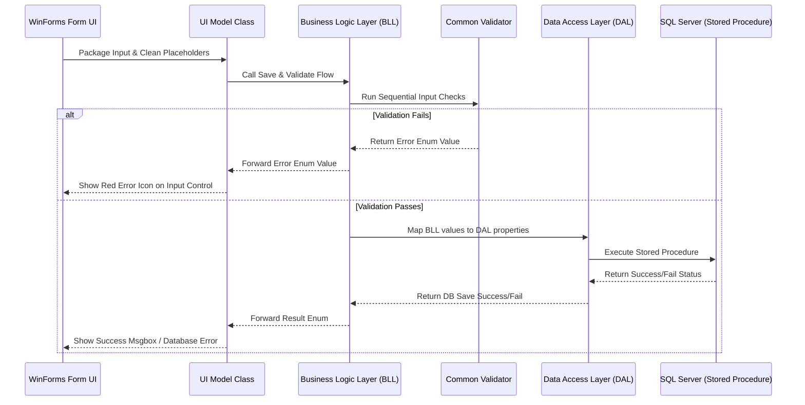

# 🚀 Step-by-Step Developer Guide: Building Modules (Lent, Expense, Credit, Note, Borrow, Task)

This guide explains how the layered data validation and saving system works in our project, and how you can implement this same pattern for any new module. 

Instead of showing raw code blocks in this documentation, this document focuses on **how the system works conceptually** and guides you to the exact source files in the codebase to read the implementation.

---

## 📌 Phase 1: How Data Flows (The Architecture Flow)

To save any data, it passes through 5 distinct stages in order:

### **Step 1: WinForms UI Form (User Input)**
* The user interacts with the form, fills out TextBoxes, selects items in ComboBoxes, and clicks **Save**.
* When the Save button is clicked, the UI clears any existing error marks (`errorProvider1.Clear()`).
* The UI gathers the raw values and assigns them to properties of a **UI Model class**.

### **Step 2: UI Model (The Cleaner & Bridge)**
* The UI Model acts as a cleaner and a bridge. 
* It cleans up any placeholder text (for example, if a text field says `"Select Amount"` or `"Enter description"`, it maps this to an empty string `""` before sending it to the Business Logic Layer).
* It sets up the properties of the corresponding Business Logic Layer (BLL) class.
* It triggers validation by calling the BLL's main validation method.

### **Step 3: Business Logic Layer - BLL (The Gatekeeper)**
* The BLL class contains properties representing the fields and holds an instance of the Data Access Layer (DAL) class.
* It performs validation by passing its fields to methods inside `CommonValidator.cs` in a sequential order.
* **If any check fails**: The BLL halts immediately and returns the specific validation error enum back to the UI Model, which forwards it to the Form.
* **If all checks pass**: The BLL maps its property values to the DAL object properties and invokes the DAL's database-saving method.

### **Step 4: Data Access Layer - DAL (The Database Execution)**
* The DAL class is responsible for connecting to the database using the shared database connection helper.
* It creates a connection, sets up a command pointing to a SQL Server **Stored Procedure**, maps its properties to command parameters to prevent SQL injection, and executes the query.
* It returns a boolean (`true`/`false`) indicating whether rows were successfully affected in the database.

### **Step 5: Error and Success Display (UI Handover)**
* The UI Form receives the validation result enum.
* In a `switch` block, the UI determines how to respond to the result:
  * **On Success**: Display a confirmation message box and clear/refresh the form.
  * **On Validation Errors**: Pass the specific validation result and target controls to `ErrorHelper.ShowValidationError()`. This highlights the exact input element on the form with a red error icon and sets the tooltip description.
  * **On Database Failure**: Show a generic error message indicating database storage issues.

---

## 🛠️ Step-by-Step: How to Implement a New Module (e.g., Note, Expense, Borrow)

When building a new module, you should follow this structural checklist and look at the existing **Lent** module files as your blueprint.

### **Step 1: Database Setup**
1. **Table Creation**: Create a table in SQL Server with the necessary fields and primary key/foreign key constraints.
2. **Stored Procedures**:
   * Create an Insert Stored Procedure (e.g. `spInsertNote`, `spInsertExpense`).
   * Create Select/Read Stored Procedures (e.g. `spGetAllNotes` or `spGetAllNoteTags`).

### **Step 2: Create the DAL Class**
* **Responsibility**: Houses properties matching the database fields, constructs `SqlConnection`/`SqlCommand`, maps parameters, opens the connection, executes `ExecuteNonQuery`, and handles database exceptions.
* **Where to create**: Put it in `DALayer/NewModule/` directory.
* **Code Reference**: Open and read [LentDAL.cs](file:///e:/Dekstop%20Application/PersonalExpenseCreditTracker/WinFormsApp/PersonalExpenseCreditTracker/DALayer/Lent/LentDAL.cs) to see how to implement this layer.

### **Step 3: Create the BLL Class & Add Validation Rules**
* **Responsibility**: Declares properties matching the inputs, instantiates the DAL class, sequentially calls `CommonValidator` functions, maps properties to the DAL class, and runs the save command.
* **Where to create**: Put it in `BLLayer/NewModule/` directory.
* **Code Reference**: Open and read [LentBLL.cs](file:///e:/Dekstop%20Application/PersonalExpenseCreditTracker/WinFormsApp/PersonalExpenseCreditTracker/BLLayer/Lent/LentBLL.cs) to see how validations are evaluated and how the BLL routes data to the DAL.

### **Step 4: Create the UI Model Class**
* **Responsibility**: Declares the properties, holds the BLL instance, sets BLL properties, and delegates execution to BLL validation.
* **Where to create**: Put it in `PersonalExpenseCreditTracker/Modules/NewModule/` folder.
* **Code Reference**: Open and read [LentUi.cs](file:///e:/Dekstop%20Application/PersonalExpenseCreditTracker/WinFormsApp/PersonalExpenseCreditTracker/PersonalExpenseCreditTracker/Modules/Lent/LentUi.cs) to see how properties are set up and mapped.

### **Step 5: Setup the Form (Add/Edit UI Form)**
* **Responsibility**: Declares the form controls, binds standard list data (ComboBoxes) on Load using common UI helper functions, clears the `ErrorProvider` on clicking Save, copies control text values into the UI Model (checking for placeholders), runs the save method, and switches on the result code to show errors using `ErrorHelper`.
* **Where to create**: Put it in `PersonalExpenseCreditTracker/Modules/NewModule/` folder.
* **Code Reference**: Open and read [AddLentControls.cs](file:///e:/Dekstop%20Application/PersonalExpenseCreditTracker/WinFormsApp/PersonalExpenseCreditTracker/PersonalExpenseCreditTracker/Modules/Lent/AddLentControls.cs) to see the Save button click event handler (`btnLentAddSave_Click`) and how UI validation cases are handled.

---

## ⚠️ How to Add a New Validation Check and Error Message

When creating other modules (like Expense, Borrow, Note, etc.), you will need custom checks and UI tooltips. Here is the process:

### **Part A: Add the Validation Result Enum**
1. Open the file [CommonValidator.cs](file:///e:/Dekstop%20Application/PersonalExpenseCreditTracker/WinFormsApp/PersonalExpenseCreditTracker/BLLayer/Common/CommonValidator.cs).
2. Inside the `public enum ValidationResult`, add your new validation error identifiers (e.g. `TitleEmpty`, `ContentEmpty`, `CategoryInvalid`).
3. Inside the `CommonValidator` class, add any general-purpose static helper validation functions if needed (e.g., checks for length, null references, or numeric ranges).

### **Part B: Map to UI Error Messages**
1. Open the file [ErrorHelper.cs](file:///e:/Dekstop%20Application/PersonalExpenseCreditTracker/WinFormsApp/PersonalExpenseCreditTracker/PersonalExpenseCreditTracker/Common/ErrorHelper.cs).
2. Inside the `ShowValidationError` method overloads (one for `TextBox` and one for `ComboBox`), add your new `ValidationResult` case blocks.
3. For each case:
   * Call `errorProvider.SetError(control, "Your custom user-friendly error message here.")`.
   * Call `control.Focus()` to focus on the input field with the invalid data.

By referencing the files inside the repository and following this blueprint, you can develop robust validation and data routing for any new module.
