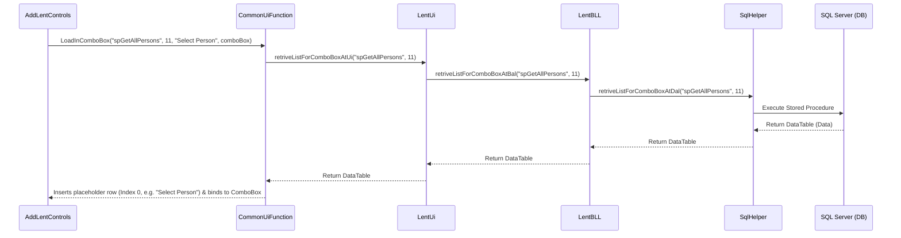
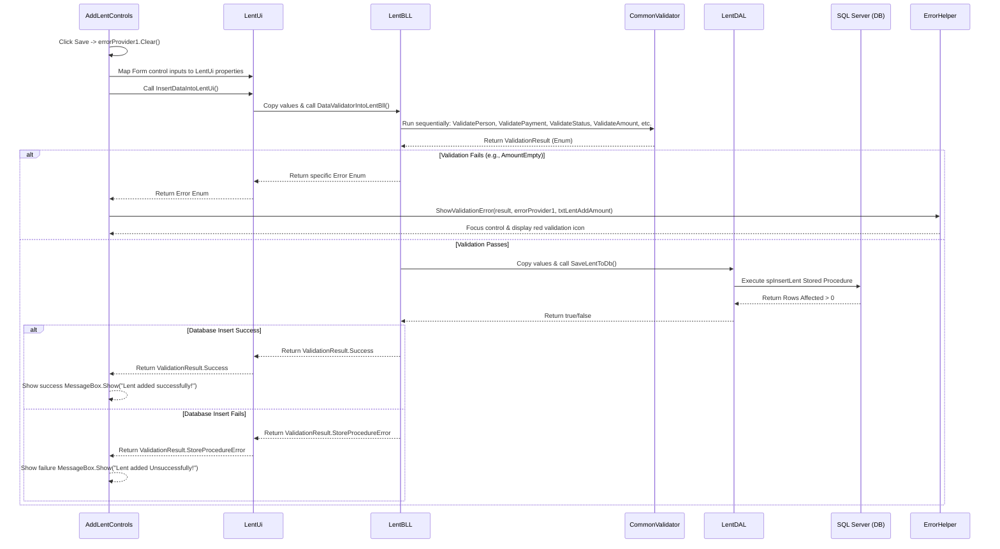

# 📘 Lent Module Architecture & Data Flow Guide

This document describes how the **Add Lent** feature is structured and how data flows across different layers: from loading database values into dropdowns, validating user inputs using enums, displaying errors, and finally storing the data in the database. 

This guide serves as a reference pattern. Developers can use this exact architecture and flow to implement other modules like **Add Expense**, **Add Borrow**, etc.

---

## 🏗️ Architectural Overview (Layered Design)

The project uses a **3-Layer Architecture** (Presentation/UI Layer, Business Logic Layer, and Data Access Layer). This ensures:
1. **Separation of Concerns (SoC)**: The UI is only responsible for rendering controls; the BLL handles business rules; the DAL handles SQL execution.
2. **Reusability**: Shared tasks like database connections and basic validations are centralized in `Common` folders.
3. **Robust Error Handling**: Standardized validation enums are passed between layers, preventing invalid data from ever reaching the database.

Here is the folder and layer mapping:

```text
PersonalExpenseCreditTracker (Solution)
│
├── 📂 PersonalExpenseCreditTracker (UI Layer - Forms, UserControls, UI Models)
│   ├── 📂 Common                      # UI Helpers (CommonUiFunction, ErrorHelper)
│   └── 📂 Modules/Lent                # UI Form (AddLentControls) & UI Model (LentUi)
│
├── 📂 BLLayer (Business Logic Layer)
│   ├── 📂 Common                      # CommonValidator (Business Validation Rules & Enums)
│   └── 📂 Lent                        # BLL logic class (LentBLL)
│
└── 📂 DALayer (Data Access Layer)
    ├── 📂 Common                      # SqlHelper (Shared SQL connection & query functions)
    └── 📂 Lent                        # DAL database class (LentDAL)
```

---

## 🔄 Visualizing the Flows

### 1. Dropdown Load Flow (Loading ComboBoxes on Form Open)

This flow loads dynamic lists (like Persons, Payment Types, and Statuses) from SQL database tables into WinForm ComboBoxes.



### 2. Save & Validate Flow (On clicking Save button)

This flow handles what happens when a user clicks the "Save" button to submit data.



---

## 🔎 Layer-by-Layer Code & Function Analysis

### 1. Presentation/UI Layer

#### 📄 [AddLentControls.cs](file:///e:/Dekstop%20Application/PersonalExpenseCreditTracker/WinFormsApp/PersonalExpenseCreditTracker/PersonalExpenseCreditTracker/Modules/Lent/AddLentControls.cs)
- **Form Load (`AddLentControls_Load`)**: Populates the UI ComboBoxes by calling:
  ```csharp
  CommonUiFunction.LoadInComboBox("spGetAllPersons", 11, "Select Person", comboBoxLentSelectPerson);
  CommonUiFunction.LoadInComboBox("spGetAllPaymentTypes", "Select Payment Type", comboBoxLentPaymentType);
  CommonUiFunction.LoadInComboBox("spGetAllLentBorrowStatus", "Select Status", comboBoxLentStatus);
  ```
- **Save Event (`btnLentAddSave_Click`)**:
  - Clears previous error icons: `errorProvider1.Clear()`.
  - Instantiates `LentUi` and extracts values from the form. It sanitizes inputs (e.g., placeholder texts like `"Select Amount"` are mapped to `""`, and missing dates are mapped to `DateTime.MinValue`).
  - Calls validation: `CommonValidator.ValidationResult result = lentUi.InsertDataIntoLentUi();`.
  - Processes results inside a `switch (result)` block. If it receives an error enum, it calls `ErrorHelper.ShowValidationError(...)` to point the user to the invalid field.

#### 📄 [LentUi.cs](file:///e:/Dekstop%20Application/PersonalExpenseCreditTracker/WinFormsApp/PersonalExpenseCreditTracker/PersonalExpenseCreditTracker/Modules/Lent/LentUi.cs)
- **Purpose**: Acts as a Data Transfer Object (DTO) and boundary between WinForms UI controls and logic layers.
- **Key Methods**:
  - `InsertDataIntoLentUi()`: Copies UI properties into `LentBLL` and calls `lentBLL.DataValidatorIntoLentBll()`.
  - `retriveListForComboBoxAtUi()`: Acts as a static pass-through method calling BLL methods to get data lists for dropdowns.

---

### 2. Business Logic Layer (BLL)

#### 📄 [LentBLL.cs](file:///e:/Dekstop%20Application/PersonalExpenseCreditTracker/WinFormsApp/PersonalExpenseCreditTracker/BLLayer/Lent/LentBLL.cs)
- **Purpose**: Implements core business logic. It does not know about the database connection or the textboxes on the form.
- **Key Methods**:
  - `DataValidatorIntoLentBll()`: Checks fields one by one using `CommonValidator` functions. If any validation fails, it aborts execution immediately and returns the failure enum. If all pass, it maps BLL properties to `LentDAL` properties and triggers `lentDal.SaveLentToDb()`.
    ```csharp
    result = CommonValidator.ValidateAmount(amount);
    if (result != CommonValidator.ValidationResult.Success) return result;
    ```
  - `retriveListForComboBoxAtBal()`: Passes request to `SqlHelper` in the DAL.

---

### 3. Data Access Layer (DAL)

#### 📄 [LentDAL.cs](file:///e:/Dekstop%20Application/PersonalExpenseCreditTracker/WinFormsApp/PersonalExpenseCreditTracker/DALayer/Lent/LentDAL.cs)
- **Purpose**: Executes SQL statements. It uses raw SQL connections but encapsulates queries inside Stored Procedures.
- **Key Methods**:
  - `SaveLentToDb()`: Opens SQL connection using `SqlHelper.connectionString`, calls the stored procedure `"spInsertLent"`, passes inputs as parameters (protects against SQL Injection), calls `ExecuteNonQuery()`, and returns a boolean status.
  - `ReturnBoolean(int value)`: Helper that maps rows affected (usually `> 0`) to `true` or `false`.

---

### 4. Common & Utility Layer

#### 📄 [CommonValidator.cs](file:///e:/Dekstop%20Application/PersonalExpenseCreditTracker/WinFormsApp/PersonalExpenseCreditTracker/BLLayer/Common/CommonValidator.cs)
- **Enum `ValidationResult`**: A single centralized place for all potential statuses:
  ```csharp
  public enum ValidationResult
  {
      Success,
      PersonInvalid,
      PaymentInvalid,
      StatusInvalid,
      AmountEmpty,
      AmountInvalid,
      AmountTooLarge,
      DeadlineInvalid,
      DescriptionInvalid,
      StoreProcedureError
      // ... (other values like EmailInvalid, PhoneInvalid etc.)
  }
  ```
- **Validation Rules**: Standard static rules such as parsing decimals, range checks, pattern matching (Regex), and string length limits.

#### 📄 [CommonUiFunction.cs](file:///e:/Dekstop%20Application/PersonalExpenseCreditTracker/WinFormsApp/PersonalExpenseCreditTracker/PersonalExpenseCreditTracker/Common/CommonUiFunction.cs)
- **`LoadInComboBox(...)`**: Loads data into dropdowns. It retrieves the table from the DB, inserts a placeholder row at Index 0 (e.g. Value = `0`, Display = `"Select Person"`), binds it as the ComboBox datasource, and pre-selects the first row.

#### 📄 [ErrorHelper.cs](file:///e:/Dekstop%20Application/PersonalExpenseCreditTracker/WinFormsApp/PersonalExpenseCreditTracker/PersonalExpenseCreditTracker/Common/ErrorHelper.cs)
- **`ShowValidationError(...)`**: Inspects the validation result enum and assigns clear error messages directly to the WinForms controls using an `ErrorProvider` (e.g., showing `"Please select a person."` next to a ComboBox, or `"Amount is required."` next to a TextBox).

#### 📄 [SqlHelper.cs](file:///e:/Dekstop%20Application/PersonalExpenseCreditTracker/WinFormsApp/PersonalExpenseCreditTracker/DALayer/Common/SqlHelper.cs)
- **Purpose**: Provides a global SQL connection string read from `App.config` (`DBCS`) and standard database data-retrieval functions (e.g., executing stored procedures and returning `DataTable` objects).

---

## 🛠️ Step-by-Step Developer Checklist: Implementing a New Module (e.g., Add Expense)

To create a new module like **Add Expense** following this exact pattern, follow these steps:

### Step 1: Database Setup
1. Create your database table (e.g., `Expenses`).
2. Write a stored procedure to insert data (e.g., `spInsertExpense`).
3. Write procedures to fetch list data for any dropdowns you need (e.g., `spGetAllExpenseCategories`).

### Step 2: Implement DAL
1. Create `ExpenseDAL.cs` inside `DALayer/Expense/`.
2. Define the properties to represent an expense (e.g., `amount`, `categoryId`, `expenseDate`, etc.).
3. Write `SaveExpenseToDb()` using `SqlHelper.connectionString`, parameter-binding to call `spInsertExpense`, and returning `true/false`.

### Step 3: Implement BLL & Validator Extensions
1. Open [CommonValidator.cs](file:///e:/Dekstop%20Application/PersonalExpenseCreditTracker/WinFormsApp/PersonalExpenseCreditTracker/BLLayer/Common/CommonValidator.cs) and add any new error enums needed (e.g. `CategoryInvalid`).
2. Add any module-specific validation logic (if not already handled by common methods).
3. Create `ExpenseBLL.cs` inside `BLLayer/Expense/`.
4. Implement `DataValidatorIntoExpenseBll()` which runs sequential validation checks via `CommonValidator` functions. If they pass, map BLL properties to `ExpenseDAL` and call its save method.

### Step 4: Implement UI Model
1. Create `ExpenseUi.cs` in your WinForms module folder.
2. Bind it with BLL (`ExpenseBLL`) to pass parameters and call BLL validation.

### Step 5: Design WinForm UI & Wire Events
1. In the Form Load handler, load your dropdown values:
   ```csharp
   CommonUiFunction.LoadInComboBox("spGetAllExpenseCategories", "Select Category", comboBoxCategory);
   ```
2. Open [ErrorHelper.cs](file:///e:/Dekstop%20Application/PersonalExpenseCreditTracker/WinFormsApp/PersonalExpenseCreditTracker/PersonalExpenseCreditTracker/Common/ErrorHelper.cs) and update `ShowValidationError()` to handle your new validation enums and map them to friendly error text.
3. In the form's "Save" click event handler:
   - Clear existing error flags: `errorProvider1.Clear()`.
   - Instantiate your UI Model (`ExpenseUi`), assign form values (handling placeholders).
   - Call `InsertDataIntoExpenseUi()`.
   - Use a `switch (result)` block to handle the return status (either displaying error icons on the control, or displaying a success message).
